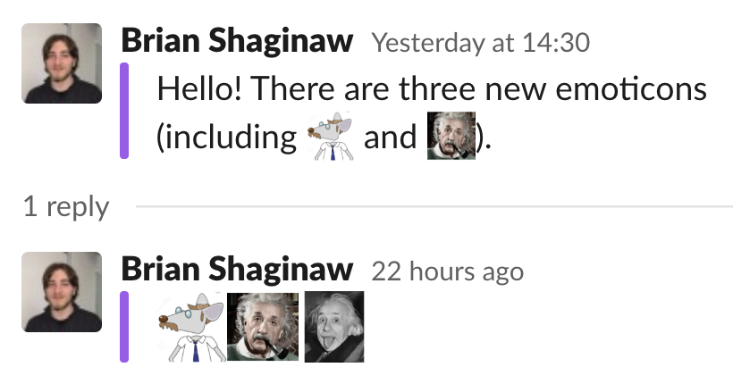

# Emoticon Tracker

🖼️ Track changes to a Slack group's emoticons.




## Setup

Currently the emoticon tracker is designed to be run on a user's local machine, _as_ that user.
It likely supports other (better) configurations, but it has not as of yet been designed with these in mind.

### Database
This emoticon tracker requires an instance of postgres 9.6+ running on the local machine.
At the moment the database and db user must be named the same as the system user running the application.
The initial table configuration can be generated by running the following:

```bash
psql -f initial.sql
```

### Install Python dependencies
It's recommended you use a virtual environment to install dependencies.
This looks like:

```bash
python3 -m venv venv
venv/bin/pip install -r requirements.txt
```

Python3.6+ is required.

### Configure your Slack credentials
Two environment variables are required to run the application:
- `SLACK_EMOTICON_ANNOUNCE_CHANNEL` is the channel to which emoticon update announcements will be posted.
  It should be of the format eg `#emoticon-updates`, but can also be a channel id such as `C12345678`
- `SLACK_USER_TOKEN` is the access token of the user or bot posting the messages and fetching the emoticons.
  User tokens can be found by inspecting the headers of requests in the Slack chat web app.

### Configure the crons
The Emoticon Tracker project exposes two scripts: [`sync.py`](sync.py) and [`announce.py`](announce.py).
- `sync.py` fetches all the emoticons from the Slack group, compares them to the emoticons tracked in your postgres instance, and syncs the difference.
  It is recommended to run this at least hourly.
- `announce.py` also performs a sync, then sends a message to the Slack channel configured in the `SLACK_EMOTICON_ANNOUNCE_CHANNEL` environment variable with the diff since the last run.
  It is recommended to run this at most daily, and ideally only on days and times when someone will be around to see it.

To run these commands regularly, one potential crontab schedule is as follows:
```crontab
0 * * * * cd "$PATH_TO_PROJECT" && source "$PATH_TO_ENV_VARS" && venv/bin/python3 sync.py >> sync.log 2>&1
30 14 * * 1-5 cd "$PATH_TO_PROJECT" && source "$PATH_TO_ENV_VARS" && venv/bin/python3 announce.py >> announce.log 2>&1
```

For each command this will load the environment variables, run the command, and append the results to a log file.
The `sync` command is configured to run hourly on the hour, and the `announce` command is configured to run every weekday at 2:30 PM (local time).
